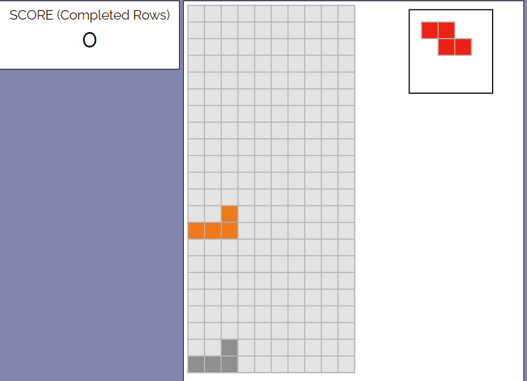

# Tetris-AI

## Overview

This is a fun AI project I decided to make over vacation. No fancy machine/deep
learning in here, just some good ol' search.

<p align="center">
    
</p>

### Built using
* [p5.js](https://p5js.org/)
* Javascript 
* HTML
* CSS

### Try it here
You can clone the repo and run the index.html locally or access it through
this [link](https://davidliii.github.io/Tetris-AI/)

## How It Works
The goal here is for an AI to play Tetris. I formalized the game as a
search problem, where the goal state is a grid with no blocks remaining.
(Obviously this is a naive interpreration of the game. Usually we'd want to clear as 
many rows possible before the blocks reach the top of the screen, with preferece to 
4-row clears to maximize the score). 

Tetris is a non-deterministic game, as the player is not given the entire sequence 
of pieces at the beginning; after each piece is placed, a new piece is (pseudo) 
randomly generated. For that reason we cannot use searching techniques such as 
UCS, A*, or IDS to beat the game - the action space is always changing. To solve
this, I used state evaluation and optimized action choices based on the current
and next piece. The state evaluation function is a linear combination of:

1. Number of holes in state
2. Average column height
3. Column height variance
4. Number of cleared rows

Mathematically evaluation function defines the cost required to reach the goal state
from the current state. Cost in Tetris is not extremely intuitive, so it is better
to think of it as how preferable a given state is compared to other states. The 
lower the value, the better the state is.

To toggle between AI mode and manual playing mode, change this property in game.js
```javascript    
this.usingAI = false;
```

The behavior of the algorithm changes depending on the weighting factors in the
state evaluation functions. Alter the parameters in player.js to change the weights
```javascript    
evaluateState(state) {
        let n_filled = this.getCompletedRows(state);
        let heights = this.getHeights(state);

        let n_holes = this.getNumHoles2(state);
        let avg_h = this.getAvgHeight(heights);
        let var_h = this.getHeightVariance(heights);

        return this.a * n_holes + 
               this.b * avg_h + 
               this.c * var_h -
               this.d * n_filled;
}
```
## Performance
On average, the current implementation clears around 100 lines per game.

## Future Progress
The current implementation is greedy. It chooses the best set of moves for the 
piece that is currently being played and does not look ahead to possible states
involving the next piece. A deeper search can be implemented and may improve
performance.