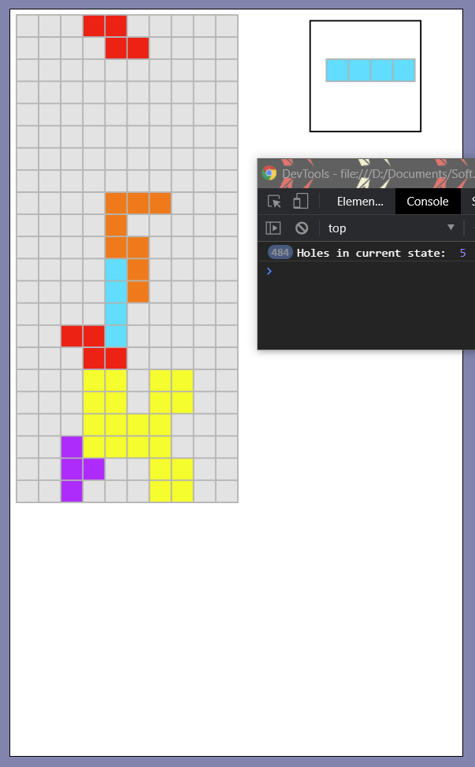

# Tetris-AI

## Overview
* * *

This is a fun AI project I decided to make over vacation. No fancy machine/deep
learning in here, just some good ol' search. 

### Built using
* [p5.js](https://p5js.org/)
* Javascript 
* HTML
* CSS

### Try it here
You can clone the repo and run the index.html locally or access it through
this [link]() (TODO add link).

## How It Works
* * *
The goal here is for an AI to play Tetris. I formalized the game as a
search problem, where the goal state is a grid with no blocks remaining.
(Obviously this is a naive interpreration of the game. Usually we'd want to clear as 
many rows possible before the blocks reach the top of the screen, with preferece to 
4-row clears to maximize the score). 

Tetris is a non-deterministic game, as the player is not given the entire sequence 
of pieces at the beginning; after each piece is placed, a new piece is (pseudo) 
randomly generated. For that reason we cannot use searching techniques such as 
UCS, A*, or IDS to beat the game - the action space is always changing. To solve
this, I used state evaluation and optimized action choices based on the current
and next piece. The state evaluation function is as follows:

(TODO insert function)

Mathematically evaluation function defines the cost required to reach the goal state
from the current state. Cost in Tetris is not extremely intuitive, so it is better
to think of it as how preferable a given state is compared to other states. The 
lower the value, the better the state is.

### Holes
Holes are defined to be empty grid cells that are enclosed by locked pieces from 
the initial piece spawn location. To find the number of holes, I performed BFS 
starting from the top-left grid cell and keep track of each visited cell. Then I 
subtract that value from the total number of empty cells, yielding the holes. 
When choosing states, we want to minimize the number of holes present. 
Here are some examples of hole-counting:

    
      

### Average Column Height / Variance
Highly filled columns are generally not favorable since the higher a stack of blocks, 
the closer that state is to losing. However, the average column height alone is
not a sufficient indicator as the uniformity of height of each column may affect
the average height. Therefore the column height variance is also used in state
selection. These values are minimzied when choosing states.

### Filled Blocks
While the other state evaluation methods are designed as heuristics that 
approximate the cost to a goal state, the number of filled blocks in state is
interpreted as the true cost from the current state to the goal state. This value
should is also minimized when choosing states.

### State Iteration
(TODO)

