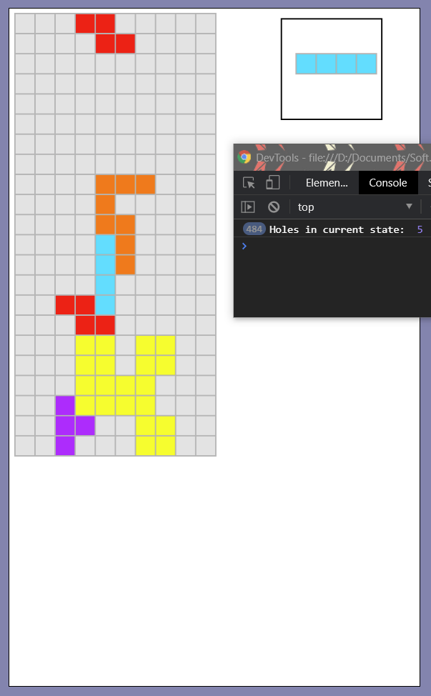
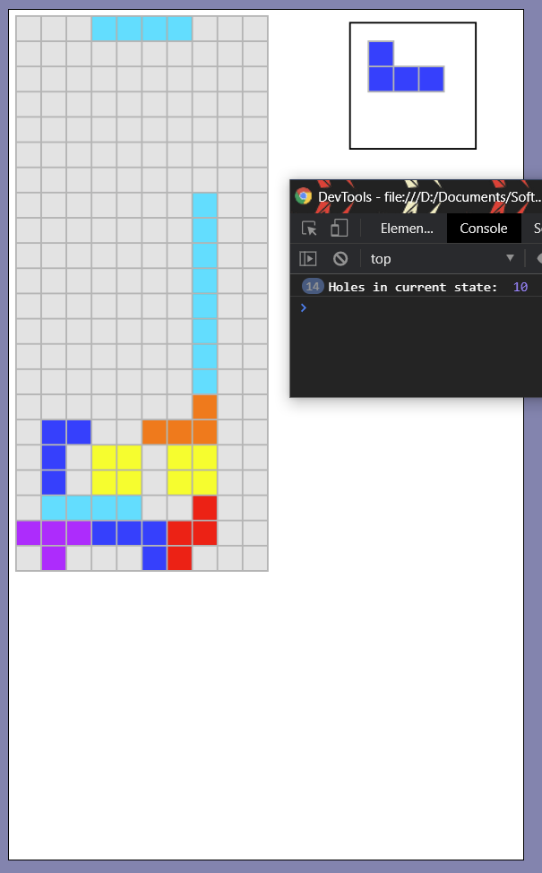
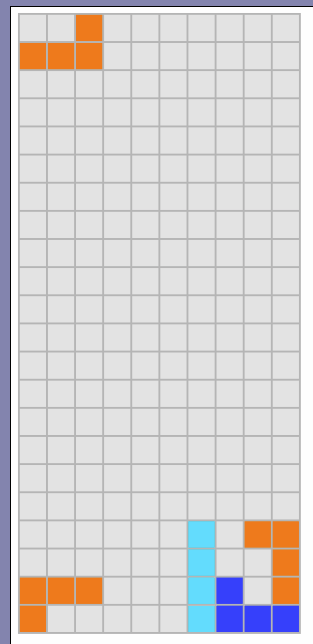
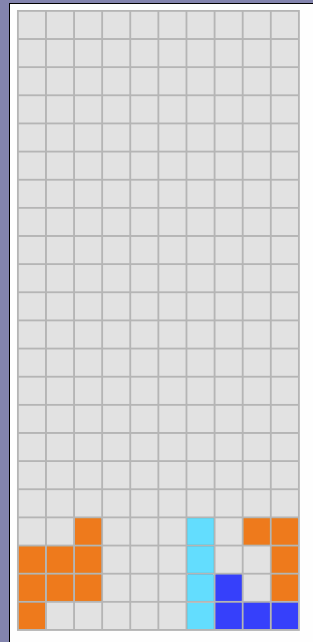
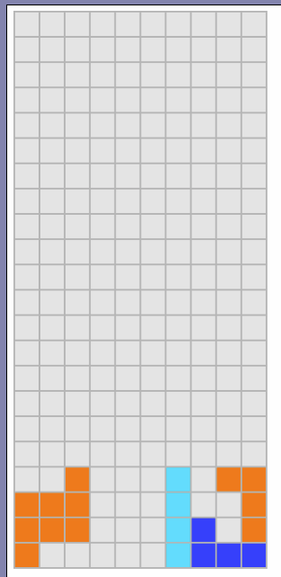
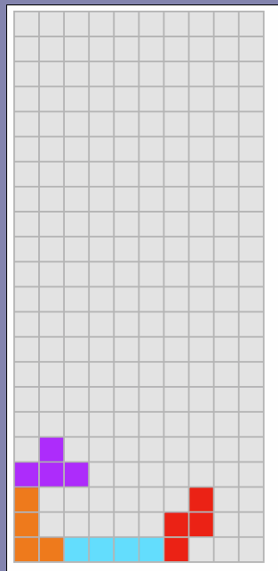

# Documentation

### Holes
Holes are defined to be empty grid cells that are enclosed by locked pieces from 
the initial piece spawn location. To find the number of holes, I performed BFS 
starting from the top-left grid cell and keep track of each visited cell. Then I 
subtract that value from the total number of empty cells, yielding the holes. 
When choosing states, we want to minimize the number of holes present. 
Here are some examples of hole-counting:

    
      

(Update) Now holes are defined to be empty gridspaces with a filled blocked
above it or empty gridspaces underneath other holes. This redefinition was made
because the AI choose unfavorable states that had "tunnels" where BFS could reach
but the pieces themselves could not. 

### Average Column Height / Variance
Taller filled columns are generally not favorable since the higher a stack of blocks, 
the closer that state is to losing. However, the average column height alone is
not a sufficient indicator as the uniformity of height of each column may affect
the average height. Therefore the column height variance is also used in state
selection. These values are minimzied when choosing states.

### Filled Rows
In Tetris, when a row is completed filled, it gets cleared and every piece above 
the row gets shifted downwards. Thus the more rows that are filled in a given state,
the more preferable that state is. In the cost evaluation function, this value is
weighted by a negative value since a higher number of filled rows is better.

### State Iteration
To determine the best sequence of actions the AI should take, it needs to result
in the best possible state achievable (whichever state incurs the least cost). To
do this, every possible future state is determined, its cost is computed, and the
least costly state is chosen. From there a sequence of actions is found to get to
the desired state.

To find every possible state, we not only take into account the possible locations
of the current piece, but also the next piece. Thus the search tree has depth 2, 
where the root is the current state, the nodes at depth 1 correspond to the possible
states due to placing the current piece, and the leaf nodes represent the states 
after placing the next piece. The leaf node states are evaluated using the cost
function and the least costly state is chosen. 

To emulate possible states, each piece is dropped vertically from each location 
in every orientation until it hits a filled grid from below. At that point, 
any additional horizontal/spinning moves are made without changing elevation 
(thus allowing for T-spins, sliding, etc.). The same process is used for the next piece. 
Finally, we take the best final state from the next piece and compute the moves 
required to reach that state. Although the states are expanded like a tree, 
only the current best final state is kept.

Here is the state expansion algorithm in action:

1. Initial block placements are determined and dropped vertically in every
possible orientation

    

        

            
        

        

            <i> Initial Block Placements </i>
        

    

    

        

                
        

        

            <i> Drop Locations </i>
        

    

2. After blocks are dropped, any additional horizontal/rotational moves are made 
and are considered in end-state selection. This makes moves such as sliding/T-spinning
possible for the AI

    

        

            
        

        

            <i> Sliding from a soft drop </i>
        

    

    

        

                
        

        

            <i> T-spin (bottom-right corner) </i>
        

    

